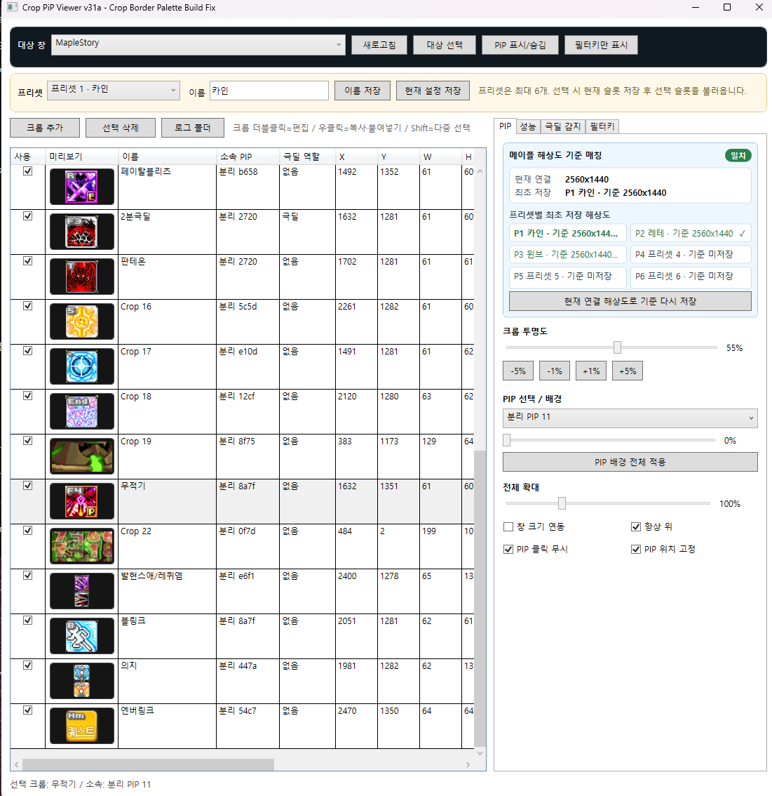

# Maple PiP Manager (CropPipViewer)

MapleStory 창의 원하는 영역을 잘라 별도의 PiP(Always-on-top overlay)로 배치하는 Windows용 도구입니다.

> 공개 베타: **v0.9.0-beta**  
> 내부 개발 기준: **v33c**



## 주요 기능

- MapleStory 창의 원하는 영역을 여러 개 크롭하여 PiP로 표시
- 크롭 분리/병합 및 다중 선택
- PiP 위치/크기/배치 저장
- 프리셋 6개
- PiP별 크롭 투명도 / 배경 투명도
- 크롭별 색상 테두리 및 투명도
- 크롭 스타일 복사/붙여넣기
- PIP 클릭 무시
- 메이플 창 기준 PIP 위치 고정
- FilterKeys 상태/토글용 소형 PiP
- 극딜/준극딜/오리진 쿨타임 감지 **실험 기능(Beta)**

## 설치 / 실행

### 일반 사용자
GitHub의 **Releases** 페이지에서 최신 `win-x64` ZIP을 받은 뒤 **전체 압축 해제**하고 `CropPipViewer.exe`를 실행합니다.

공식 Release ZIP은 **Windows x64용 .NET 8 self-contained 배포**입니다.

- `.NET Runtime` 별도 설치 불필요
- `.NET Desktop Runtime` 별도 설치 불필요
- `.NET SDK` 별도 설치 불필요
- 실행에 필요한 .NET 런타임은 `CropPipViewer.exe`에 포함
- Release ZIP을 전체 압축 해제한 뒤 `CropPipViewer.exe` 실행
- 최상단에는 실행 EXE와 `docs` 폴더만 제공

지원 환경은 **Windows 10 2004(빌드 19041) 이상 x64 / Windows 11 x64**입니다.

> `.NET SDK`는 소스에서 직접 빌드하는 개발자에게만 필요합니다. 일반 사용자는 필요하지 않습니다.

### 개발자
- Windows 10/11
- .NET 8 SDK

```powershell
dotnet restore .\src\CropPipViewer\CropPipViewer.csproj
dotnet build .\src\CropPipViewer\CropPipViewer.csproj -c Release
```

## 기본 사용법

1. MapleStory 실행
2. 프로그램에서 대상 창 선택
3. `크롭 추가`로 필요한 영역 지정
4. PiP 위치/크기 조절
5. 필요한 경우 프리셋 저장
6. 전투 중 조작이 필요 없으면 `PIP 클릭 무시` 사용

자세한 내용은 [사용 가이드](docs/USER_GUIDE.md)를 참고하세요.

## 극딜 감지 기능 주의

극딜 감지는 현재 **실험 기능**입니다. 화면 기반 학습/판정과 등록 키 입력 검증을 사용하지만 게임 상황, 해상도, UI 변화에 따라 미탐/오탐이 발생할 수 있습니다. 중요한 판단을 이 기능 하나에만 의존하지 마세요.

## 데이터 / 네트워크

- 설정: `%APPDATA%\CropPipViewer\settings.json`
- 로그: `%APPDATA%\CropPipViewer\latest.log`
- 현재 소스 기준 별도 서버 업로드 기능은 없습니다.
- 게임 메모리를 읽거나 수정하는 기능은 현재 소스에 포함되어 있지 않습니다.

자세한 내용은 [PRIVACY.md](PRIVACY.md)를 참고하세요.

## 알려진 문제

[KNOWN_ISSUES.md](docs/KNOWN_ISSUES.md)를 참고하세요.

## 버그 제보

가능하면 GitHub Issues에 아래 내용을 포함해 주세요.

- 프로그램 버전
- Windows 버전
- MapleStory 해상도
- 재현 순서
- 스크린샷
- 필요한 경우 `%APPDATA%\CropPipViewer\latest.log`

로그를 올리기 전 개인 정보가 포함되어 있지 않은지 확인해 주세요.

## 소스 이용 조건

현재 이 저장소에는 별도의 오픈소스 라이선스를 부여하지 않습니다. 공개된 소스는 검토 목적으로 열람할 수 있지만, 복제·수정·재배포·상업적 이용 권한이 자동으로 부여되는 것은 아닙니다.
